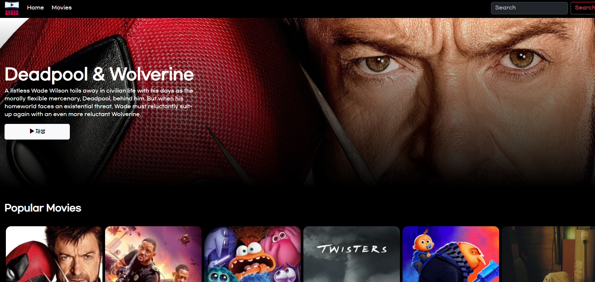
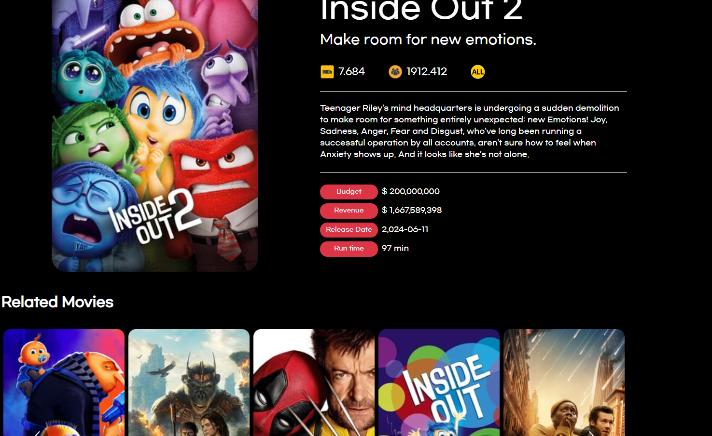

# 🚩 Movie_site

   
  
  
   

   
* 데모앱🎬 : https://scmovie.netlify.app
    

  
## 📌 프로젝트 소개

   
이번 프로젝트는 실시간 데이터를 효과적으로 관리하고 사용자에게 향상된 경험을 제공하는 웹 애플리케이션 개발을 목표로 하였습니다.   
리액트 쿼리(React Query)를 도입하여 데이터 패칭, 캐싱, 동기화 및 에러 처리를 간편하게 구현하고, 결과적으로 성능과 사용자 만족도를 높이는 데 중점을 두었습니다.

* 개발 인원: 1명(개인 프로젝트)
* Deployment: Netlify, github
* FrontEnd: React,react-query, bootstrap, react-router, react-youtube, react-paginate, react-multi-carousel

 

## 🔨 기술 스택

|    React    | 
| :--------:  |
|  ![react]   |

 

## 🔍 구현 기능

#### 키워드 검색 

#### 영화 예고편 보기

#### 영화 선호도 정렬, 페이지네이션, 영화 슬라이드, 장르별 필터링

#### 영화 상세페이지

 

## ✏️ 배운 점 & 아쉬운 점

리액트 쿼리는 데이터 패칭과 상태 관리를 훨씬 더 효율적이고 간편하게 만들어주는 라이브러리라고 생각합니다.  
프로젝트의 복잡성을 줄이고, 사용자 경험을 개선하는 데 큰 도움이 되었으며, 앞으로도 다양한 프로젝트에서 적극적으로 활용하고 싶은 라이브러리입니다.   
리액트 쿼리를 도입하면서 데이터 관리의 부담을 덜고, 더 나은 품질을 개발할 수 있었습니다.  
처음 학습하는데 적용하기 어려움이 있긴 하지만, 전체적인 코드 관리와 성능 개선을 고려하면 충분히 배울 가치가 있었던 시간이였습니다.

  

 

<!-- Stack Icon Refernces -->

[react]: src/imgs/react.svg
